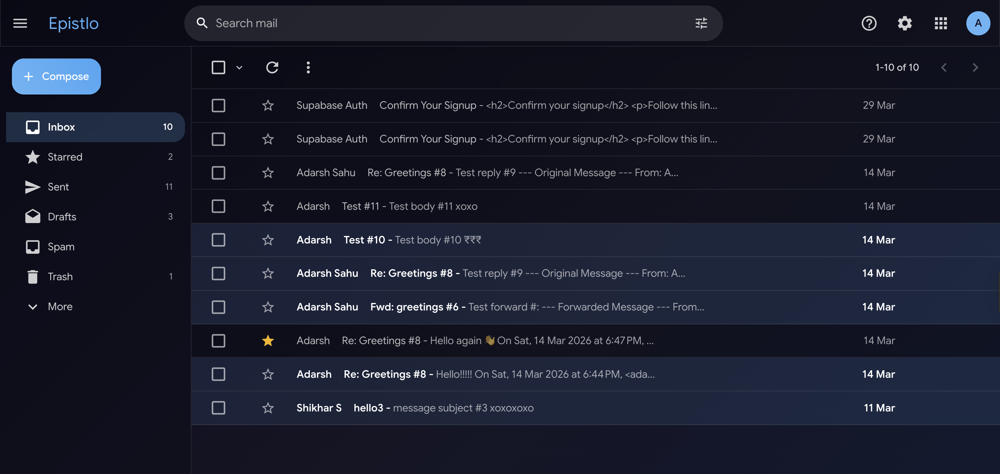
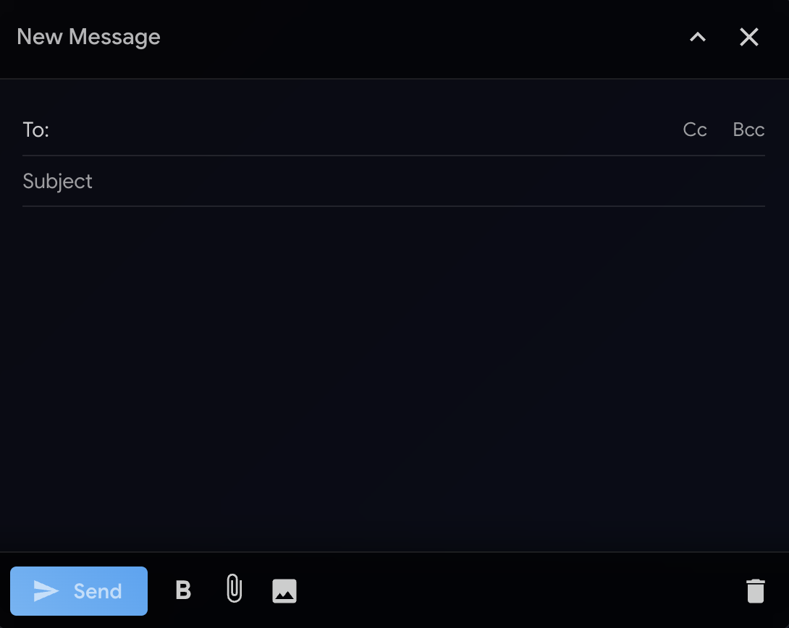
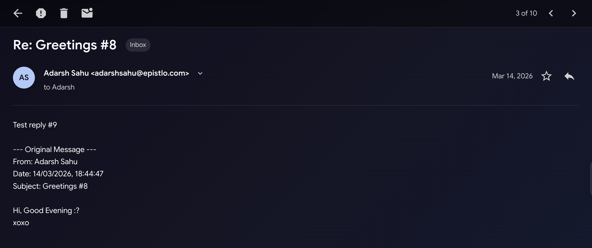
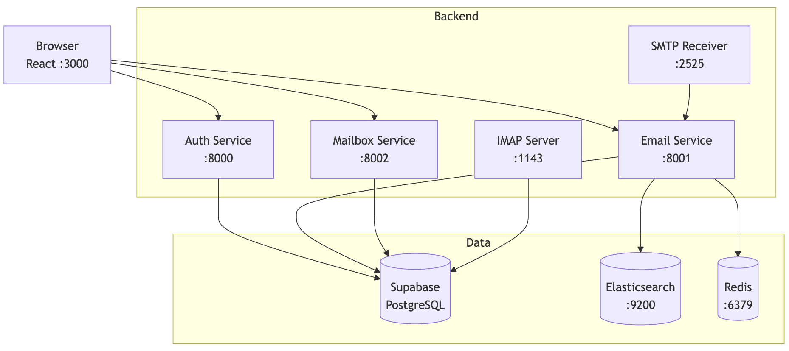
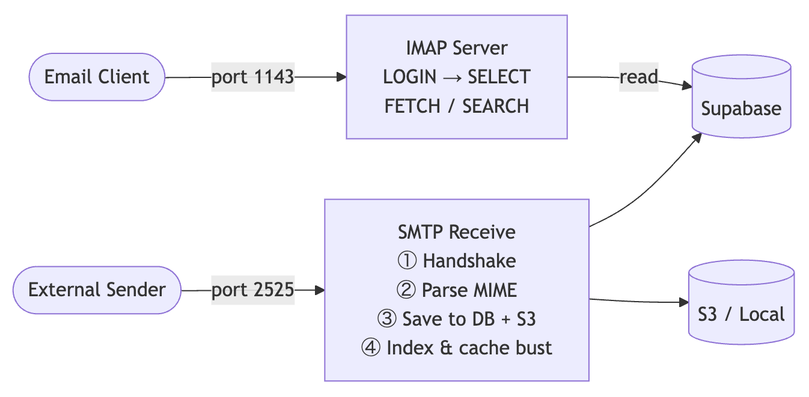

# Epistlo

> A self-hosted email service with real **@epistlo.com** addresses, built on FastAPI microservices and a custom SMTP/IMAP stack.

*From Latin epistola, Greek epistolē: "something sent to someone."*


[](LICENSE)

**Live → [epistlo.com](https://epistlo.com)**

---

## Screenshots

| Landing | Inbox |
|---|---|
|  |  |

| Compose | Email View |
|---|---|
|  |  |

---

## Features

- **Real mailboxes** — every account gets a working `@epistlo.com` address
- **SMTP & IMAP** — send/receive over standard protocols; connect any email client
- **Attachments** — up to 25 MB per email, stored on AWS S3
- **Full-text search** — powered by Elasticsearch, falls back to Supabase `ilike`
- **Folders & starring** — system folders + custom, read/unread tracking
- **Responsive UI** — Material-UI dark theme, works on mobile and desktop
- **Rate limiting** — per-user send limits configurable via env vars

---

## Architecture



---

## Email Infrastructure



---

## Tech Stack

| Layer | Technology |
|---|---|
| Frontend | React 18, TypeScript, Material-UI, Redux Toolkit, React Router v6 |
| Backend | Python 3.11, FastAPI, Uvicorn (3 microservices) |
| Database | Supabase (PostgreSQL + Auth + Row-Level Security) |
| Outbound email | Resend (epistlo.com domain verified) |
| Inbound email | Custom SMTP server |
| IMAP | Custom IMAP server |
| Storage | AWS S3 (falls back to local filesystem) |
| Search | Elasticsearch (falls back to Supabase search) |
| Cache | Redis (optional) |
| Hosting | AWS EC2, Nginx, Let's Encrypt |

---

## Quick Start

### Prerequisites

- Python 3.11+
- Node.js 18+
- Docker (for Elasticsearch and Redis)

### 1. Clone & configure

```bash
git clone https://github.com/sahu-adarsh/epistlo.git
cd epistlo
cp backend/.env.example backend/.env   # fill in values below
cp frontend/.env.example frontend/.env
```

### 2. Start the backend

```bash
python -m venv venv && source venv/bin/activate
pip install -r requirements.txt

docker-compose up -d   # starts Elasticsearch + Redis

cd backend
python run_integrated_server.py
```

This starts all 3 FastAPI services plus the SMTP/IMAP servers.

### 3. Start the frontend

```bash
cd frontend
npm install
npm start   # http://localhost:3000
```

---

## Environment Variables

### `backend/.env`

| Variable | Description |
|---|---|
| `SUPABASE_URL` | Your Supabase project URL |
| `SUPABASE_KEY` | Supabase anon/public key |
| `SUPABASE_SERVICE_KEY` | Supabase service role key |
| `SECRET_KEY` | JWT signing key — `openssl rand -hex 32` |
| `RESEND_API_KEY` | Resend API key for outbound email |
| `MAX_EMAILS_PER_HOUR` | Per-user send rate limit |
| `MAX_EMAILS_PER_DAY` | Per-user daily send limit |

### `frontend/.env`

| Variable | Description |
|---|---|
| `REACT_APP_SUPABASE_URL` | Your Supabase project URL |
| `REACT_APP_SUPABASE_ANON_KEY` | Supabase anon/public key |

> Always run the backend from the `backend/` directory — `load_dotenv()` reads `.env` from the working directory.

---

## License

MIT License. See [LICENSE](LICENSE) for details.
